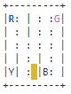
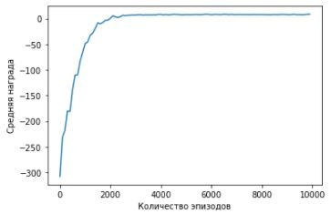
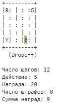

# Задание 7. Teach me, senpai
Научить робота разумному, доброму и вечному, используя всю мощь обучения с подкреплением.
<br/>Среда Taxi-v3 из фреймфорка gym: https://gym.openai.com/envs/Taxi-v3/

**Описание:**
- Определить и описать какие у среды есть состояния и награды, а также какие действия можно совершать.
- Реализовать один из алгоритмов поиска оптимальной стратегии: Value Iteration, Policy Iteration, Monte Carlo, SARSA, Q-learning.
- Получив оптимальную стратегию сыграть 10 000 эпизодов и вывести оценку стратегии в виде средней награды за все игры и/или количество побед.
- Визуализировать один эпизод игры с оптимальной стратегией.

```python
# Импорт основных библиотек
import numpy as np

# Импорт библиотеки обучения с подкреплением
import gym

# Импорт библиотеки построения диаграмм и графиков
import matplotlib.pyplot as plt

# Импорт дополнительных библиотек
from IPython.display import clear_output
from time import sleep

# Определение режима вывода графиков
%matplotlib inline
```

## Описание среды
```python
# Создание и сброс исходного состояния среды "Taxi"
env = gym.make('Taxi-v3')
env.reset()

# Вывод информации о размерности пространств действий и состояний
print("Количество действий:  {}".format(env.action_space.n))
print("Количество состояний: {}".format(env.observation_space.n))
```
```
Количество действий:  6
Количество состояний: 500
```

```python
# Вывод кадра текущего состояния среды "Taxi"
env.render()
```


**`Description`**
</br>There are four designated locations in the grid world indicated by **R(ed)**, **G(reen)**, **Y(ellow)**, and **B(lue)**. When the episode starts, the taxi starts off
at a random square and the passenger is at a random location. The taxi
drives to the passenger's location, picks up the passenger, drives to the
passenger's destination (another one of the four specified locations), and
then drops off the passenger. Once the passenger is dropped off, the episode ends.

**`Actions`**
</br>There are 6 discrete deterministic actions:
- 0: move south
- 1: move north
- 2: move east
- 3: move west
- 4: pickup passenger
- 5: drop off passenger

**`Observations`**
</br>There are 500 discrete states since there are 25 taxi positions, 5 possible locations of the passenger (including the case when the passenger is in the taxi), and 4 destination locations. Note that there are 400 states that can actually be reached during an episode. The missing states correspond to situations in which the passenger is at the same location as their destination, as this typically signals the end of an episode. Four additional states can be observed right after a successful episodes, when both the passenger and the taxi are at the destination. This gives a total of 404 reachable discrete states.

**`Passenger locations:`**
- 0: R(ed)
- 1: G(reen)
- 2: Y(ellow)
- 3: B(lue)
- 4: in taxi

**`Destinations:`**
- 0: R(ed)
- 1: G(reen)
- 2: Y(ellow)
- 3: B(lue)

**`Rewards`**
- -1 per step unless other reward is triggered.
- +20 delivering passenger.
- -10  executing "pickup" and "drop-off" actions illegally.

**`Rendering`**
- blue: passenger
- magenta: destination
- yellow: empty taxi
- green: full taxi
- other letters (R, G, Y and B): locations for passengers and destinations

**State space is represented by:** taxi_row, taxi_col, passenger_location, destination
```python
```

## Реализация алгоритма
```python
# Функция эпсилон-жадной стратегии исследования среды
def epsilon_greedy(q_table, state, eps):
    if np.random.rand() > eps:
        return np.argmax(q_table[state])
    else:
        return np.random.choice(np.arange(q_table.shape[1]))

# Функция обновления Q-значения (функция Беллмана)
def update_value(alpha, gamma, q_table, state, action, reward, next_state=None):
    q_value = np.max(q_table[next_state]) if next_state is not None else 0
    q_new = q_table[state][action] + alpha * (reward + gamma * q_value - q_table[state][action])
    return q_new

# Функция реализации алгоритма обучения с подкреплением Q-learning
def q_learning(env, num_episodes, alpha, gamma=1.0, plot_every=100):
    # Создание Q-таблицы (пары состояние-действие)
    q_table = np.zeros([env.observation_space.n, env.action_space.n])
    
    # Создание оценок качества обучения агента
    tmp_scores, avg_scores = [], []
    
    for i_episode in range(1, num_episodes + 1):
        # Вывод прогресса обучения агента
        if i_episode % 100 == 0:
            clear_output(wait=True)
            print("\rЭпизод: {}/{}".format(i_episode, num_episodes))
        
        # Инициализация переменных
        score = 0
        done = False
        eps = 1.0 / i_episode
        
        # Сброс состояния среды 'Taxi'
        state = env.reset()
        
        # Обновление значений Q-таблицы для каждого состояния и действия
        while not done:
            action = epsilon_greedy(q_table, state, eps)
            next_state, reward, done, info = env.step(action)
            score += reward
            q_table[state][action] = update_value(alpha, gamma, q_table, state, action, reward, next_state)        
            state = next_state
        else:
            tmp_scores.append(score)
        
        # Расчет качества обучения агента на основе последних эпизодов
        if (i_episode % plot_every == 0):
            avg_scores.append(np.mean(tmp_scores[-plot_every:]))
    
    return q_table, num_episodes, avg_scores
```

```python
# Обучение агента с помощью алгоритма Q-learning
q_table, num_episodes, scores = q_learning(env, 10000, .05)
```
```
Эпизод: 10000/10000
```

```python
# Вывод прогресса обучения агента методом Q-learning
plt.plot(np.linspace(0, num_episodes, len(scores), endpoint=False), np.asarray(scores))
plt.xlabel('Количество эпизодов')
plt.ylabel('Средняя награда')
plt.show()
```


```python
# Вывод оценки качества обучения агента
print(('Лучшая средняя награда:'), np.max(scores))
```
```
Лучшая средняя награда: 8.44
```

## Оценка оптимальной стратегии
```python
# Инициализация переменных
episodes = 10
total_epochs, total_penalties, scores = 0, 0, []

# Оценка качества работы агента
# Насколько точно агент может подбирать и высаживать пассажиров
for _ in np.arange(episodes):
    state = env.reset()
    score, done, epochs, penalties = 0, False, 0, 0
    
    while not done:
        action = np.argmax(q_table[state])
        state, reward, done, info = env.step(action)
        score += reward
        
        if reward == -10:
            penalties += 1

        epochs += 1
    else:
        scores.append(score)
    
    total_penalties += penalties
    total_epochs += epochs

# Вывод результатов оценки качества работы агента
print('\033[1m' + 'Результаты после {} эпизодов'.format(episodes) + '\033[0m')
print('Средняя награда за все эпизоды: {}'.format(np.mean(scores)))
print('Среднее число шагов в эпизоде:', total_epochs / episodes)
print('Среднее число штрафов за эпизод:', total_penalties / episodes)
```
```
Результаты после 10 эпизодов
Средняя награда за все эпизоды: 8.0
Среднее число шагов в эпизоде: 13.0
Среднее число штрафов за эпизод: 0.0
```

## Визуализация
```python
# Сброс состояния среды и инициализация переменных
state = env.reset()
score, done, epochs, penalties = 0, False, 0, 0

# Визуализация работы агента
# Выбор оптимальных действий на основе изученных значений Q-таблицы
while not done:
    action = np.argmax(q_table[state])
    state, reward, done, info = env.step(action)
    score += reward

    if reward == -10:
        penalties += 1
    
    epochs += 1
    
    clear_output(wait=True)
    env.render()
    print('\n' + 'Число шагов:', epochs)
    print('Действие:', action)
    print('Награда:', reward)
    print('Число штрафов:', penalties)
    print('Сумма наград:', score)
    sleep(0.5)
```

